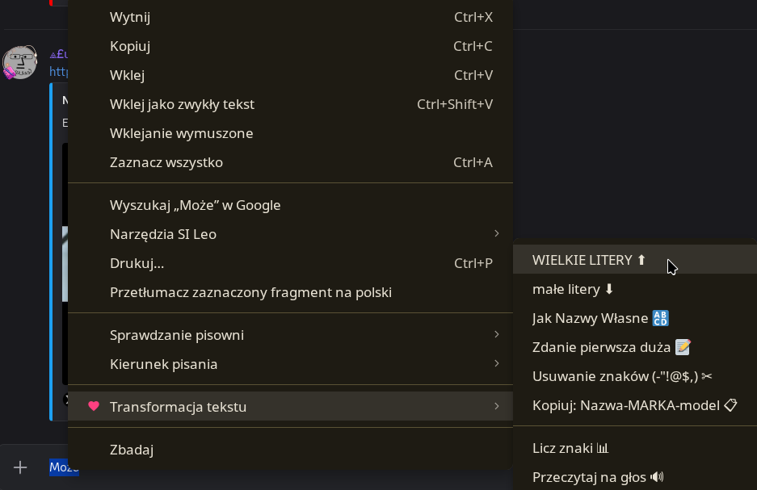

# Text Transformer

Prosty i lekki dodatek do przeglądarek (Chrome, Brave, Edge), który ułatwia codzienną pracę z tekstem w formularzach i na stronach www.

## Główne funkcje

- **Zmiana wielkości liter:** Szybka zamiana na DUŻE, małe, Jak Nazwy Własne czy format zdania.
- **Kopiuj jako Slug (Nazwa-MARKA-model):** Automatycznie czyści polskie i niemieckie znaki (ą -> a, ü -> u), zamienia spacje na myślniki i kopiuje gotowy tekst do schowka.
- **Usuwanie zbędnych znaków:** Czyści tekst z niepożądanych znaków specjalnych i zamienia podwójne spacje na pojedyncze.
- **Licznik znaków:** Szybki podgląd liczby znaków, słów i linii w zaznaczonym tekście.
- **Czytanie na głos (TTS):** Możliwość odczytania zaznaczonego tekstu przez syntezator mowy.
  - *Uwaga dla użytkowników Brave/Chromium:* Jeśli funkcja nie działa domyślnie, należy zainstalować rozszerzenie z głosami, np. [Piper Text-to-Speech](https://chromewebstore.google.com/detail/piper-text-to-speech-voic/ppnfahcipommelgaapjalhooaeeblmeg).

## Skróty klawiszowe

- `Alt + Shift + D` - Zamień na DUŻE LITERY
- `Alt + Shift + M` - Zamień na małe litery

> **Wskazówka:** Jeśli skróty nie działają lub chcesz je zmienić, wpisz w pasku adresu przeglądarki `chrome://extensions/shortcuts` i ustaw własne kombinacje klawiszy dla dodatku.

## Instalacja

1. Pobierz zawartość tego repozytorium.
2. Otwórz przeglądarkę i przejdź do `chrome://extensions/`.
3. Włącz **Tryb dewelopera** (Developer mode).
4. Kliknij **Załaduj rozpakowane** (Load unpacked) i wybierz folder z dodatkiem.

## Licencja

MIT
